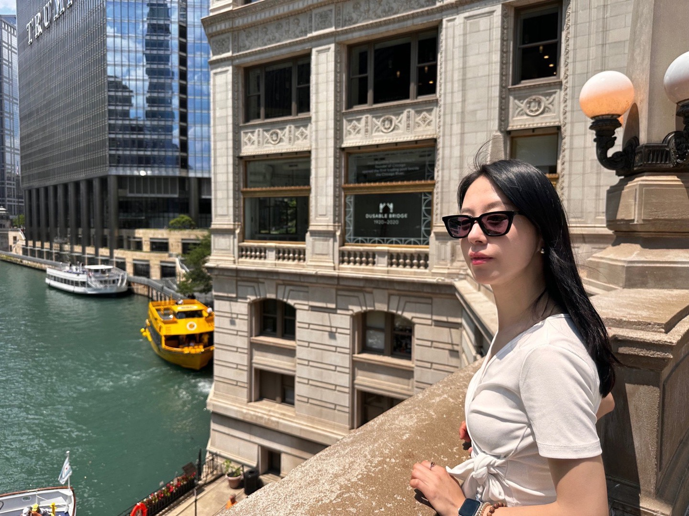

# Academic Portfolio Website

A minimal, typography-focused academic portfolio website inspired by [John Hewitt's website](https://nlp.stanford.edu/~johnhew/).

## Features

- Extremely simple and minimal design
- Typography-centered with minimal decorations
- Responsive design (mobile-optimized)
- Clean white background
- Max-width 800px for optimal readability
- Apple system fonts
- Subtle hover effects on publications
- External link icons (↗)
- Email click-to-copy functionality
- Google Analytics ready

## Project Structure

```
academic-portfolio/
├── index.html          # Homepage (intro, bio, contact)
├── publications.html   # Publications list
├── cv.pdf             # Your CV (add your own)
├── css/
│   └── style.css      # Stylesheet
├── images/
│   └── profile.jpg    # Profile photo (optional)
└── papers/            # Paper PDFs (optional)
    ├── paper1.pdf
    └── paper2.pdf
```

## Customization Guide

### 1. Update Personal Information

**In `index.html`:**
- Replace `[Your Name]` with your actual name
- Update affiliation (institution, department)
- Edit bio section with your background
- Update research interests
- Add your contact links (email, Google Scholar, GitHub, LinkedIn, Twitter)
- Update the email in the `copyEmail()` function

**In `publications.html`:**
- Replace placeholder publications with your actual papers
- Update authors, titles, venues, and years
- Add links to PDFs, arXiv, code repositories, etc.

### 2. Add Profile Photo (Optional)

1. Add your photo to `images/profile.jpg`
2. In `index.html`, uncomment this line:
   ```html
   <!--  -->
   ```

### 3. Add Your CV

- Place your CV PDF file as `cv.pdf` in the root directory
- Or update the link in both HTML files if using a different filename

### 4. Add Google Analytics (Optional)

1. Get your Google Analytics Measurement ID
2. In both HTML files, uncomment the Google Analytics code
3. Replace `GA_MEASUREMENT_ID` with your actual measurement ID

### 5. Customize Styling

Edit `css/style.css` to customize:
- Colors (currently uses blacks and grays)
- Font sizes
- Spacing
- Max-width
- Any other visual elements

## Local Development

Simply open `index.html` in your web browser to preview locally.

Or use a simple HTTP server:

```bash
# Python 3
python -m http.server 8000

# Python 2
python -m SimpleHTTPServer 8000

# Node.js
npx http-server
```

Then visit `http://localhost:8000` in your browser.

## Deployment

### GitHub Pages

1. Create a repository named `philhelenina.github.io`
2. Push all files to the repository
3. Your site will be live at `https://philhelenina.github.io`

```bash
git init
git add .
git commit -m "Initial commit"
git branch -M main
git remote add origin https://github.com/philhelenina/philhelenina.github.io.git
git push -u origin main
```

### Custom Domain (Optional)

1. Add a `CNAME` file with your domain name
2. Configure DNS settings with your domain provider
3. See [GitHub Pages documentation](https://docs.github.com/en/pages/configuring-a-custom-domain-for-your-github-pages-site)

### Other Hosting Options

This is a static site and can be hosted anywhere:
- Netlify
- Vercel
- AWS S3
- Google Cloud Storage
- Any web server

## Quick Start Checklist

- [ ] Update name and affiliation in `index.html`
- [ ] Write your bio and research interests
- [ ] Add your contact information and links
- [ ] Update email in the JavaScript function
- [ ] Add your publications to `publications.html`
- [ ] Add your CV as `cv.pdf`
- [ ] (Optional) Add profile photo to `images/profile.jpg`
- [ ] (Optional) Add Google Analytics tracking
- [ ] Test all links
- [ ] Preview locally
- [ ] Deploy to GitHub Pages or other hosting

## Tips

1. **Keep it minimal**: The design philosophy is simplicity. Resist the urge to add too many elements.

2. **Update regularly**: Keep your publications and news section current.

3. **Check responsiveness**: Test on mobile devices to ensure good mobile experience.

4. **Optimize images**: If using a profile photo, optimize it for web (compress, resize to ~300px).

5. **Use relative paths**: Keep all paths relative for easy local testing and deployment.

6. **PDF accessibility**: Ensure your papers and CV are accessible (check file permissions).

## License

Free to use and modify. No attribution required.

## Inspired By

- [John Hewitt](https://nlp.stanford.edu/~johnhew/)
- Many other minimal academic websites in the NLP/AI community

---

**Last updated:** October 2024
